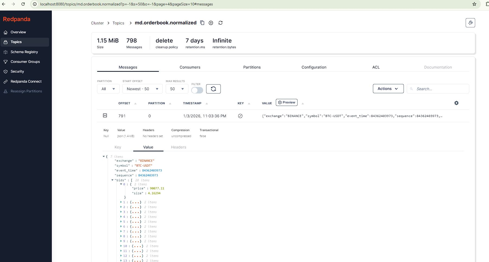
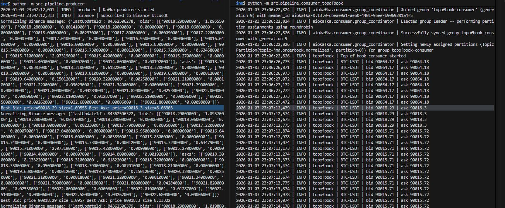
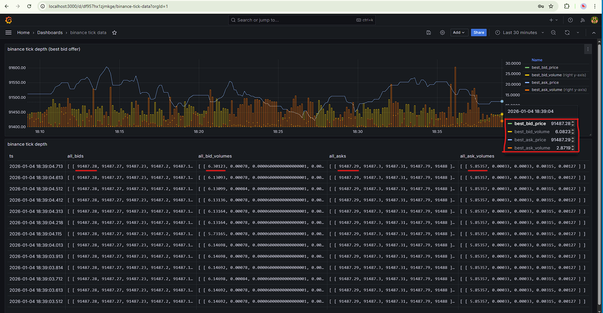

# Trading Market Data Pipeline

> Real-time cryptocurrency market data ingestion, storage, and visualization pipeline

Stream order book updates from **Binance** and **Coinbase**, normalize them, store in **ClickHouse**, and visualize with **Grafana**.


---

## 📁 Project Structure

```
trading-market-data-pipeline/
├── src/
│   ├── common/           # Shared configuration, logging, schemas
│   ├── exchanges/        # Exchange WebSocket clients (Binance, Coinbase)
│   └── pipeline/         # Data normalization and producer
├── clickhouse/
│   └── init.sql          # ClickHouse table definitions and materialized views
├── docker-compose.yml    # Infrastructure (Redpanda, ClickHouse, Grafana)
├── requirements.txt      # Python dependencies
└── .venv/                # Virtual environment
```

---

## 🚀 Quick Start

### 1. Start Infrastructure

```bash
docker compose up -d
```

**Services:**
- **Redpanda (Kafka):** `localhost:19092`
- **Redpanda Console:** http://localhost:8080
- **ClickHouse:** `localhost:8123` (HTTP), `localhost:9000` (Native)
- **Grafana:** http://localhost:3000 (admin/admin)

### 2. Set up Python Environment

```bash
uv venv --python 3.12
source .venv/bin/activate
uv pip install -r requirements.txt
```

### 3. Initialize ClickHouse Tables

```bash
# Connect to ClickHouse
docker exec -it clickhouse clickhouse-client --password clickhouse

# Run the SQL from clickhouse/init.sql
# Creates Kafka engine, storage tables, and materialized views
```

### 4. Run Producer

```bash
export KAFKA_BROKERS="localhost:19092"
python -m src.pipeline.producer
```

Data flows automatically: **WebSocket → Kafka → ClickHouse → Grafana**

---

## 📊 Architecture

```
┌─────────────┐  ┌─────────────┐
│   Binance   │  │  Coinbase   │
│  WebSocket  │  │  WebSocket  │
└──────┬──────┘  └──────┬──────┘
       │                │
       └────────┬───────┘
                │
       ┌────────▼────────┐
       │   Python        │
       │   Normalizer    │
       │   + Producer    │
       └────────┬────────┘
                │
       ┌────────▼────────┐
       │   Redpanda      │
       │   (Kafka)       │
       └────────┬────────┘
                │
       ┌────────▼────────┐
       │  ClickHouse     │
       │  Kafka Engine   │
       └────────┬────────┘
                │
       ┌────────▼────────┐
       │  Materialized   │
       │  Views          │
       ├─────────────────┤
       │ • Depth Table   │
       │ • Top of Book   │
       └────────┬────────┘
                │
       ┌────────▼────────┐
       │    Grafana      │
       │  (Dashboards)   │
       └─────────────────┘
```

---

## 🔧 Data Flow Details

### 1. **WebSocket Ingestion**
Python clients connect to Binance and Coinbase WebSocket APIs for real-time order book updates.

### 2. **Normalization**
Exchange-specific formats are converted to a unified schema(example below only has 2 levels for brevity):
```json
{
  "symbol": "BTC-USDT",
  "b": [90100.5, 90100.0],       // bid prices
  "bv": [3.5, 2.1],              // bid volumes
  "a": [90105.0, 90105.5],       // ask prices
  "av": [4.2, 1.8],              // ask volumes
  "timestamp": 1704321600000
}
```

### 3. **Kafka Streaming**
Normalized messages are published to Redpanda topic: `md.orderbook.normalized`

### 4. **ClickHouse Ingestion**
**Kafka Engine Table** (`md_orderbook_stream_kafka`) consumes from Redpanda in real-time.

### 5. **Materialized Views**
Data is automatically processed into two tables:
- **`md_orderbook_depth`**: Full order book depth (all price levels)
- **`md_top_of_book`**: Best bid/ask only (calculated from depth)

### 6. **Grafana Visualization**
Connect Grafana to ClickHouse to create dashboards for:
- Real-time price charts
- Bid-ask spread analysis
- Order book depth visualization

---

## 🗄️ ClickHouse Schema

### Key Tables

| Table | Purpose | Update Method |
|-------|---------|---------------|
| `md_orderbook_stream_kafka` | Kafka consumer | Real-time from Redpanda |
| `md_orderbook_depth` | Full order book storage | Materialized view from Kafka |
| `md_top_of_book` | Best bid/ask only | Materialized view from depth |

### Materialized Views
ClickHouse automatically transforms data as it arrives:
1. Kafka stream → Full depth table
2. Full depth → Top of book (extracts first element of bid/ask arrays)

---

## 🛠️ Configuration

### Environment Variables
```bash
KAFKA_BROKERS=localhost:19092
KAFKA_TOPIC=md.orderbook.normalized
LOG_LEVEL=INFO
```

### Service Ports

| Service | Port | Purpose |
|---------|------|---------|
| Redpanda | 19092 | Kafka protocol (external) |
| Redpanda Console | 8080 | Web UI |
| ClickHouse | 8123 | HTTP interface |
| ClickHouse | 9000 | Native protocol |
| Grafana | 3000 | Dashboard UI |

---

## 📦 Dependencies

- **aiokafka** - Async Kafka producer
- **aiohttp** - WebSocket connections
- **pydantic** - Data validation
- **ujson** - Fast JSON serialization

---

## 📈 Querying Data

### ClickHouse Examples

```sql
-- View recent order books
SELECT symbol, timestamp, bid_price, ask_price
FROM md_top_of_book
ORDER BY timestamp DESC
LIMIT 10;

-- Calculate average spread by symbol
SELECT 
    symbol,
    avg(ask_price - bid_price) as avg_spread,
    count() as update_count
FROM md_top_of_book
WHERE timestamp > now() - INTERVAL 1 HOUR
GROUP BY symbol;

-- View full depth for a symbol
SELECT symbol, b, bv, a, av, timestamp
FROM md_orderbook_depth
WHERE symbol = 'BTC-USDT'
ORDER BY timestamp DESC
LIMIT 1;
```

### Connect to ClickHouse

**Command Line:**
```bash
docker exec -it clickhouse clickhouse-client --password clickhouse
```

**GUI (DBeaver/DataGrip):**
- Host: `localhost`
- Port: `8123` (HTTP) or `9000` (Native)
- User: `default`
- Password: `clickhouse`
- Database: `marketdata`

---

## 🧪 Development

```bash
# Start all services
docker compose up -d

# View logs
docker compose logs -f

# Stop services
docker compose down

# Stop and remove all data
docker compose down -v
```

### Example Screenshots
##### Redpanda Console showing binance depth market data for BTC-USDT:



##### program 1 fetches market data via websocket from binance and publishes to redpanda (kafka). program2 consumes from redpanda, gets the best bid and ask.


##### grafana dashboard to display time series data of best bid and ask prices for btc-usdt, and the table to show the depth. Binance depth frequency is ~100ms.

---

## 🚀 Performance

**Throughput:**
- Python producer: ~10,000 msg/sec
- ClickHouse ingestion: ~50,000 rows/sec
- Current load: ~200 msg/sec (ample headroom)

**Scalability:**
- Handles 50+ trading pairs comfortably
- Sub-second latency from exchange to database
- Grafana queries respond in milliseconds

###### For actual production load, bottleneck may arise from python GIL. If we have multiple exchanges and many trading pairs, we need to consider multiprocessing or use a more performant language like Go, Rust or c++ for the producer.
---

## 📝 License

MIT

---

## 🤝 Contributing

Contributions welcome! Please open an issue or submit a pull request.